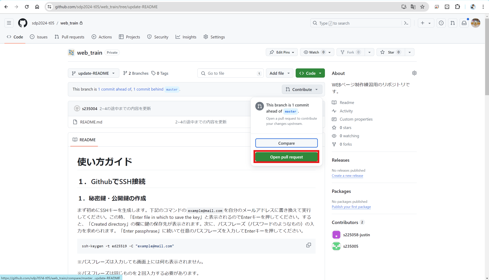
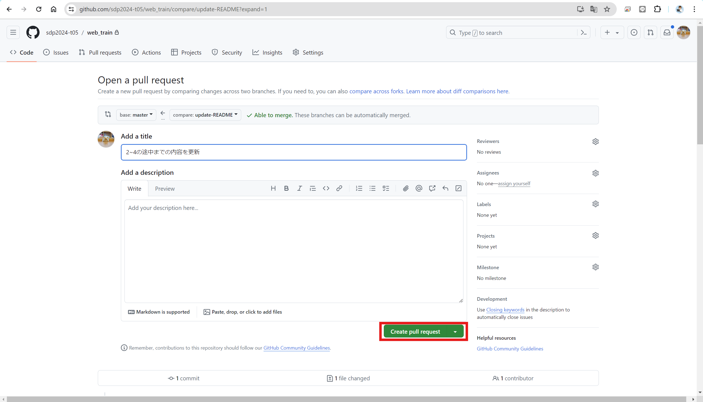
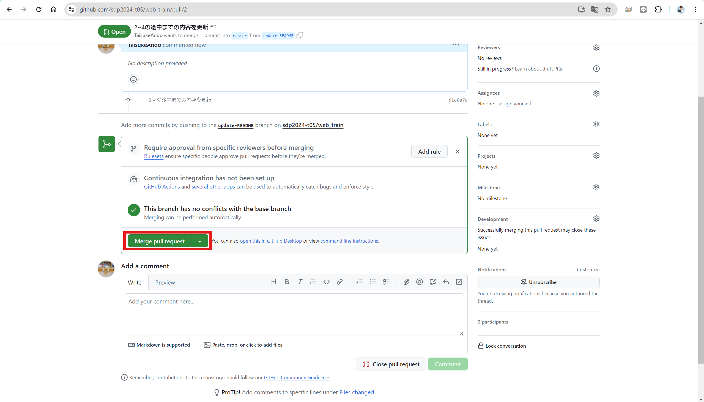

# Git・Github使い方ガイド

## バージョン管理の概念

以下の内容は、バージョン管理についての理解がある前提で、操作の手順についてを説明しています。バージョン管理の概念から学習した方は以下の動画を参考に学習を行ってください。
[https://www.youtube.com/watch?v=_RLmIG8rRIc](https://www.youtube.com/watch?v=_RLmIG8rRIc)

## ファイル編集の一連の流れ

### １．ブランチの切り替え

下記のコマンドの`example`を適切なブランチ名に書き換えることでブランチを切り替えることができます。**ファイルに変更を加える際は、`master`ブランチで編集しないように注意してください。**

```bash
git checkout example
```

### ２．最新の状態に更新

下記のコマンドを実行することで、masterブランチの最新状態を、移動先のブランチに反映させることができます。**ファイルに変更を加える際は、コンフリクトを避けるため、常に最新状態に更新してください。**

```bash
git pull origin master
```

### ３．ステージングエリアへの追加

コミットするファイルをステージングエリアに追加します。`file_name`を対象のファイル名に変更して実行してください。`file_name`を指定しない場合は、変更を加えたすべてのファイルがステージングエリアに追加されます。

```bash
git add file_name
```

### ４．コミット

下記のコマンドを実行することで、コミットすることが出来ます。`コミットメッセージ`には、誰が読んでも変更内容を把握できるメッセージを記述してください。

```bash
git commit -m"コミットメッセージ"
```

### ５．プッシュ（リモートリポジトリに反映）

下記のコマンドの`s235000`を変更を加えたブランチ名に書き換えて実行することで、リモートリポジトリに変更をアップロードすることができます。

```bash
git push origin s235000
```

### ６．プルリクエストの作成とマージ

まず初めに、編集を加えたブランチに切り替えます。


次にプルリクエストの作成ページに移動します。


`title`や`discription`を分かりやすく記入した後、プルリクエストを作成します。


プルリクエストに問題がないことを確認出来たら、以下の画像のようにマージします、

